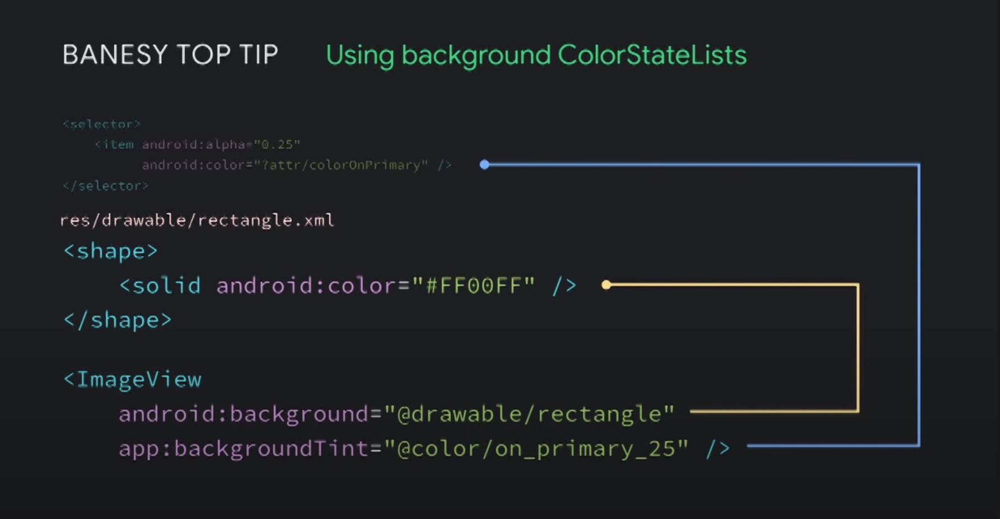

# App Template

### ViewData
1. Every parameter of ViewData should be as such that user can define that without context
2. Color should te taken as ColorRes parameter. If you need different alpha value of same color then use ColorStateList to do that. 
If you want to use theme color you can definitely do that. Just create another ColorStateList using that attribute.
4. ColorStateList won't work as view background. It will crash on API 28 and bellow. To work around this use the method in the image bellow
3. Drawable should be taken as DrawableRes parameter
4. Image should be taken ar url.
4. String should be taken as ViewString type specified in the component module. This abstract both StringRes and raw String.
6. Any dimension should be taken as dp int.
7. If at the end you need to set data as String to the view then use ViewString for that kind of data 



### Navigation Views
1. All the navigation related views should be in the activity layout inside coordinator layout. e.g. 
AppbarLayout, FAB, BottomNavBar.
2. DrawerLayout and NavigationView should also be placed in the activity
3. To update the navigation related views with respect the current fragment use navigation listeners 
and if any further assistance then use ViewModel to communicate among them. Also try to make this 
ViewModel without any custom Factory class. The sole purpose of this ViewModel would be to communicate. 
And create this ViewModel in the BaseFragment so that every fragment can use it.
4. If you have so much variation of Appbar or BottomNavigation use include that and in the other 
layout use merge tag to have multiple AppbarLayout or BottomNavigation or any other layout. and for 
better tooling support use ```tools:parentTag``` attribute

```kotlin

        /*
         * this is how you can set-up side navigation with the appbar
         */

        setSupportActionBar(mainBinding.toolbar)
        mainBinding.navigationView.itemIconTintList = null

        val navController = findNavController(R.id.nav_host_fragment)
        appBarConfiguration = AppBarConfiguration(setOf(R.id.homeFragment), mainBinding.drawerLayout)
        //here setOf(..) is the set of parent where icon will be visible for the side nav

        setupActionBarWithNavController(navController, appBarConfiguration)
        mainBinding.navigationView.setupWithNavController(navController)

        // using the listener you can do specific work for specific fragment
        navController.addOnDestinationChangedListener { _, destination, _ ->
            when (destination.id) {
                R.id.splashFragment -> {
                    
                }

                else -> {
                    
                }
            }
        }

```

### Naming convention
1. Name of any view style will start by ```Widget.AppComponent```
2. Name of any theme style will start by ```Theme.AppComponent``` 
2. Name of any theme overlay style will start by ```ThemeOverlay.AppComponent``` 
3. Name of any textAppearance will start by ```TextAppearance.AppComponent```
3. Name of any shapeAppearance will start by ```ShapeAppearance.AppComponent```
3. Name of any shapeAppearanceOverLay will start by ```ShapeAppearanceOverLay.AppComponent```
4. Use literal name for color, dimension, string or any other resources. 
e.g. button_medium_height, main_brand_color etc
4. For the variable in kotlin use CamelCase
5. For the id in xml use underscore to separate two words
6. If you create any kind of shape drawable in AS then use `shape_` as prefix


### View and Style Re-Usability
1. To re-use same view use either style or include tag along with the merge tag
2. If you want to use the same single view in multiple xml then define all the 
similar attribute in style and just add that style to that view in every xml
3. If you want to use a group of views in multiple xml then use ```include``` tag to do that. You can
use ````merge```` tag.
4. If you want to add ConstraintLayout's constrain to the ```include``` tag then you have to must
add ```height``` and ```width``` attribute. Find more [here](https://stackoverflow.com/questions/43676415/how-to-include-constraint-layout-to-another-constraint-layout-and-set-constraint)
5. Also don't forget about dimen to reuse same height and width
6. To know more about styling view [this video](https://www.youtube.com/watch?v=Owkf8DhAOSo)
8. Material [theme attributes](https://material.io/components/android/theming/color/)

### Resource File convention
1. type.xml for TexAppearance
2. styles.xml for View Styles
3. themes.xml for Themes and ThemeOverlay
4. Other files as usual

### Creating new project from this template

```bash

sudo rm -R .git

git init

mv /home/user/oldname /home/user/newname

```


